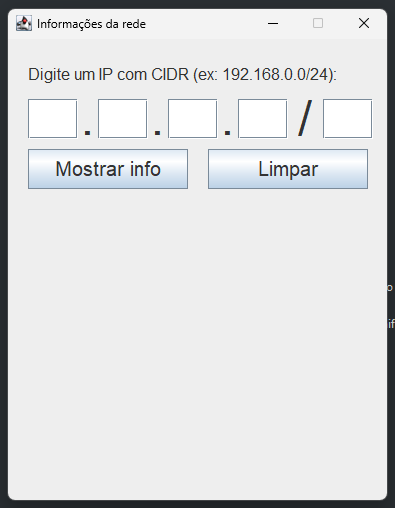
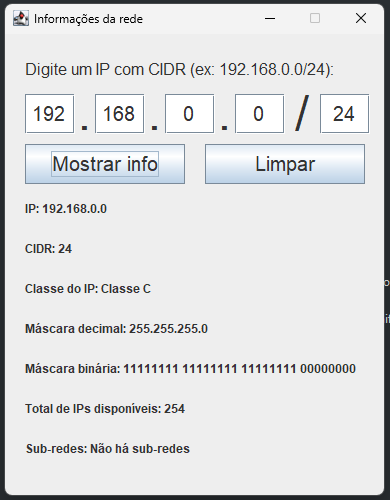
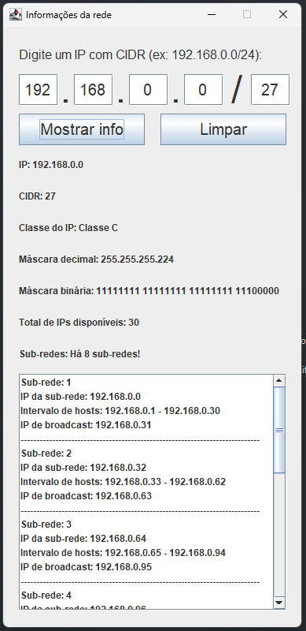

# Calculadora IP

Aplicação Java que funciona como uma calculadora de rede,  que permite ao usuário obter informações detalhadas sobre redes, dado um endereço IP e um CIDR. A aplicação retorna dados sobre a classe da rede, máscara de rede em formato decimal e binário, total de IPs disponíveis e, se o CIDR for superior a 24, também calcula as sub-redes e suas respectivas informações.

## Tecnologias
* Java

## Autor
[Nathan da Silva Costa](<https://www.linkedin.com/in/nathandasilvacosta/>)